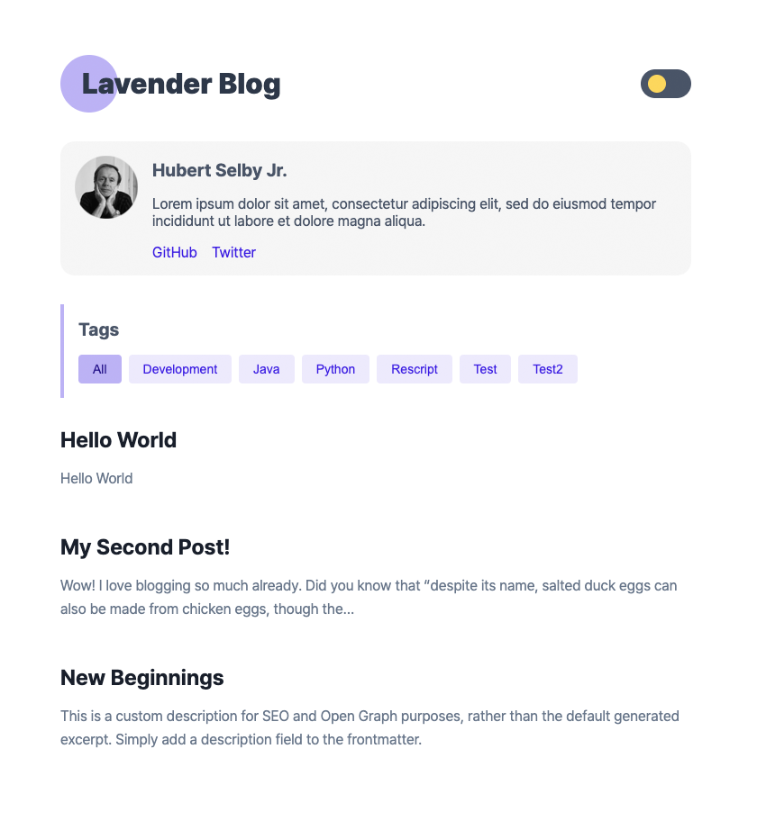

GIT TEST
# Gatsby Starter Lavender

A blog template with minimal interfaces based on Gatsby, focused on readability.

## Demo
[Live Demo](https://gatsby-starter-lavender.vercel.app)




## 🚀 Quick start

1.  **Create a Gatsby site.**

    Use the Gatsby CLI to create a new site, specifying the blog starter.

    ```shell
    # create a new Gatsby site using the blog starter
    npx gatsby new my-blog-starter https://github.com/blurfx/gatsby-starter-lavender
    ```

1.  **Start developing.**

    Navigate into your new site’s directory and start it up.

    ```shell
    cd my-blog-starter/
    yarn dev
    ```

1.  **Open the source code and start editing!**

    Your site is now running at `http://localhost:8000`!

    _Note: You'll also see a second link: _`http://localhost:8000/___graphql`_. This is a tool you can use to experiment with querying your data. Learn more about using this tool in the [Gatsby tutorial](https://www.gatsbyjs.com/tutorial/part-five/#introducing-graphiql)._

    Open the `my-blog-starter` directory in your code editor of choice and edit `src/pages/index.tsx`. Save your changes and the browser will update in real time!

## 🚀 Quick start with ...

### Vercel

[](https://vercel.com/new/git/external?repository-url=https%3A%2F%2Fgithub.com%2Fblurfx%2Fgatsby-starter-lavender)

### Netlify

[](https://app.netlify.com/start/deploy?repository=https%3A%2F%2Fgithub.com%2Fblurfx%2Fgatsby-starter-lavender)

### Gatsby Cloud

  [](https://www.gatsbyjs.com/dashboard/deploynow?url=https%3A%2F%2Fgithub.com%2Fblurfx%2Fgatsby-starter-lavender)

## Customization

### Blog Information

Edit `blog-config.ts` to change blog information.

### Theming

Edit `src/stitches.config.ts` to change the theme color.

You should modify the default object and `darkTheme` to change the light theme and dark theme colors.

# License

Zero-Clause BSD
